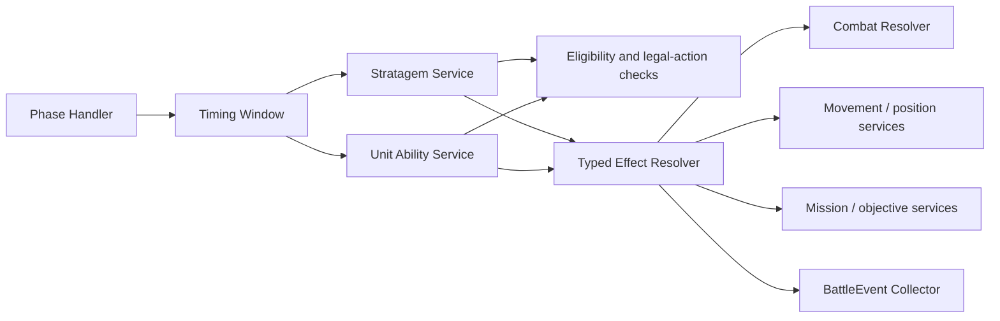
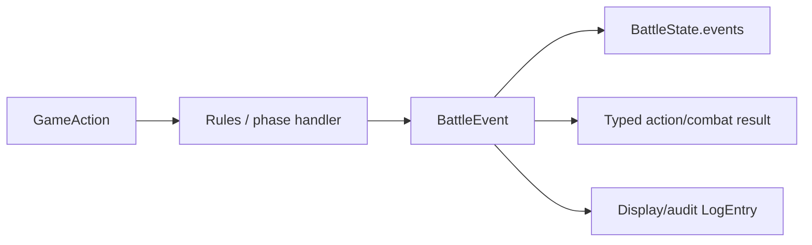

# Battle Engine Architecture

Last updated: 2026-08-23

This document describes the current battle-engine boundaries and the target architecture for completing the phase state machine and centralizing combat. It supplements [`architecture.md`](./architecture.md), which covers the wider web application.

## Design principles

- `packages/simulator-core` owns rules, state, typed actions, typed results, and typed events.
- React owns presentation, selection state, and user input. It does not implement game rules.
- `BattleState` is the serialized source of truth.
- `BattleState.log` is presentation/audit history only. Game logic must never parse log messages.
- Phases own timing, legal actions, interrupts, and completion. Shared rule services own reusable resolution.
- Prefer composition and interfaces over class inheritance. The current code has no class-inheritance hierarchy.

## Current architecture

```mermaid
flowchart TD
  App[React App] --> Controllers[Play action controllers]
  Controllers --> CoreActions[Simulator-core actions]
  CoreActions --> Simulator[simulator.ts]

  State[BattleState] *-- Units[BattleUnit[]]
  State *-- Events[BattleEvent[]]
  State *-- Logs[LogEntry[]]
  State --> Graph[battleStateMachine]
  State --> Rules[RulesEdition]

  Simulator --> Graph
  Simulator --> Combat[Shared attack helpers]
  Simulator --> Terrain[Terrain and geometry]
  Simulator --> Missions[Mission scoring]
  Simulator --> Abilities[unitAbilities.ts]
  Simulator --> Stratagems[stratagems.ts]
  Combat --> Dice[Dice helpers]
  Combat --> Rules
  Combat --> Events
  Events --> LogUI[Battle log projection]
```

The current system already has a typed phase enum, movement substeps, typed shooting/charge results, typed battle events, stratagem services, and unit-ability services. However, `simulator.ts` still coordinates most phase behavior and some combat paths remain phase-specific.

## Target battle architecture

```mermaid
flowchart TD
  Engine[Battle Engine] --> Machine[Turn State Machine]
  Engine --> EventCollector[Battle Event Collector]
  Engine --> Rules[Rules Engine]

  Machine *-- Round[Battle Round]
  Round *-- PhaseState[Active Phase State]
  PhaseState --> Command[Command Phase Handler]
  PhaseState --> Movement[Movement Phase Handler]
  PhaseState --> Shooting[Shooting Phase Handler]
  PhaseState --> Charge[Charge Phase Handler]
  PhaseState --> Fight[Fight Phase Handler]

  Command ..|> PhaseHandler[PhaseHandler interface]
  Movement ..|> PhaseHandler
  Shooting ..|> PhaseHandler
  Charge ..|> PhaseHandler
  Fight ..|> PhaseHandler

  Shooting --> Combat[Combat Resolver]
  Charge --> Combat
  Fight --> Combat
  Overwatch[Overwatch interrupt] --> Combat
  FightDeath[Fight-on-death interrupt] --> Combat

  Combat --> Dice[Dice Service]
  Combat --> Hit[Hit Resolver]
  Combat --> Wound[Wound Resolver]
  Combat --> Saves[Save and FNP Resolver]
  Combat --> Damage[Damage Allocator]
  Combat --> EventCollector

  EventCollector *-- Event[BattleEvent]
  Event --> Results[Typed combat results]
  Event --> Projection[Log projection]

  Command --> Stratagems[Stratagem Service]
  Movement --> Stratagems
  Shooting --> Stratagems
  Charge --> Stratagems
  Fight --> Stratagems
  Command --> Abilities[Unit Ability Service]
  Movement --> Abilities
  Shooting --> Abilities
  Charge --> Abilities
  Fight --> Abilities
  Stratagems --> Effects[Typed Effect Resolver]
  Abilities --> Effects
  Effects --> Combat
  Effects --> MovementRules[Movement and position services]
  Effects --> Missions[Mission and objective services]
  Effects --> EventCollector
```

## Phase ownership

Each phase handler should implement the same contract:

```ts
interface PhaseHandler {
  phase: Phase;
  getLegalActions(state: BattleState): GameAction[];
  applyAction(state: BattleState, action: GameAction): PhaseResult;
  isComplete(state: BattleState): boolean;
  enter(state: BattleState): void;
  exit(state: BattleState): void;
}
```

The handlers are composed by the state machine; they should not inherit from one another.

| Handler | Owns |
| --- | --- |
| `CommandPhaseHandler` | Command points, Battle-shock timing, command abilities, command-end scoring, and Command completion |
| `MovementPhaseHandler` | Move Units and Reinforcements substeps, movement declarations, reserves, transports, actions, and movement completion |
| `ShootingPhaseHandler` | Shooting declarations, weapon/target locking, shooting interrupts, and shooting completion |
| `ChargePhaseHandler` | Charge declarations, charge rolls, charge movement, Heroic Intervention, and charge completion |
| `FightPhaseHandler` | Fight priority, pile-in, melee declarations, Fight on Death, consolidation, and Fight completion |

The current `battleStateMachine.ts` provides the transition graph, movement substeps, round boundary, five-round limit, and phase-entry cursor resets. The remaining state-machine work is moving the phase-specific legal-action and completion logic into these handlers.

## Stratagems and unit abilities

Stratagems and unique unit abilities are cross-phase rule services. They should not be subclasses of every phase.



The rule flow is:

```text
Phase handler:       Is this timing window open?
Stratagem/ability:   Is this use legal, and what effect does it grant?
Effect resolver:     How does that typed effect change state?
Combat resolver:     How do attacks, saves, and damage resolve?
```

Examples:

- Fire Overwatch is validated by the Stratagem Service and resolved through the Combat Resolver.
- Command Re-roll modifies a pending typed roll through the Stratagem Service.
- Smokescreen grants a typed defensive effect consumed by targeting/combat rules.
- Deadly Demise is an ability-triggered effect that uses the shared mortal-wound/damage path.
- Lance, Cleave, and Fights First are ability-derived modifiers consumed by the relevant phase/combat handler.
- A unit movement ability is validated by the Ability Service and applied through movement services.

## Combat centralization

Combat should be one reusable sequence, regardless of whether it was started by Shooting, Fight, Overwatch, or Fight on Death:

```mermaid
flowchart LR
  Declaration[Weapon / target declaration] --> Attacks[Attack pool]
  Attacks --> Dice[Roll attacks]
  Dice --> Hit[Resolve hits]
  Hit --> Wound[Resolve wounds]
  Wound --> Saves[Resolve saves / FNP]
  Saves --> Damage[Allocate damage]
  Damage --> Result[Typed CombatResult]
  Result --> Events[Typed BattleEvent]
```



Phase handlers should own declaration, eligibility, and sequencing. The shared Combat Resolver should own:

- Attack counts and weapon pools
- Dice rolls
- Hit modifiers and critical hits
- Wound thresholds and critical wounds
- Saves, invulnerable saves, cover, and Feel No Pain
- Mortal and devastating wounds
- Damage rolls
- Pending damage and casualty allocation
- Typed intermediate and final results

The `combat-centralization` TODO tracks the audit required to remove equivalent phase-specific implementations.

## Events and logs

`BattleEvent` is the machine-readable event boundary. It stores phase context and typed data such as dice, targets, modifiers, outcomes, and pending damage.



`LogEntry.message` may be formatted for humans, but it is never an input to rules logic. New UI features should consume typed results or events directly.

## Inheritance and dependency conventions

Legend:

- `*--`: composition or ownership
- `-->`: dependency or service use
- `..|>`: interface implementation
- `--|>`: class inheritance

There are currently no required `--|>` inheritance links. The recommended `<|..`/`..|>` relationships are phase handlers implementing `PhaseHandler`. Shared services should be composed into handlers rather than inherited from a large base class.

## Migration order

1. Finish the phase-handler contract and move phase legal-action/completion logic out of `simulator.ts`.
2. Extract the shared Combat Resolver from shooting/fight orchestration.
3. Route Overwatch and Fight on Death through the same Combat Resolver.
4. Move stratagem and ability effects behind timing-window and typed-effect contracts.
5. Keep mission, terrain, movement, and objective services pure where possible.
6. Split `simulator.ts` only after each extracted domain has typed actions, results, events, and focused tests.

Each step should preserve the public simulator-core exports and be verified with the core tests plus the root production build.
