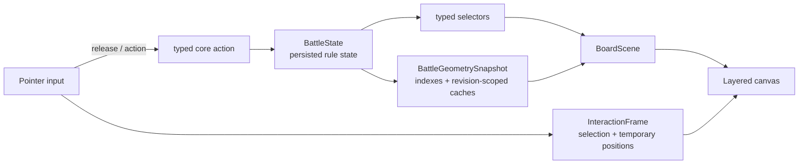

# Performance and Geometry Refactor Plan

## Decision

The durable fix is to separate persistent game state, ephemeral board interaction, and reusable board geometry. More debounce or special-case memoization would conceal the current coupling without making the system scale.



`InteractionFrame` is not game truth and is never persisted. It permits immediate drag feedback while the core receives one typed `MoveModels` action at the gesture boundary. This preserves the project rule that logs remain display history, never game state.

## Review scope and baseline

This review covered `apps/web` and `packages/simulator-core`, especially movement, LOS, canvas drawing, app-level selectors, and the battle log. No runtime behavior was changed.

The sample armies on the first shipped terrain layout form a useful minimum fixture:

| Item | Count |
| --- | ---: |
| Units | 14 |
| Models | 114 |
| Terrain mats | 12 |
| Terrain features | 34 |
| Serialized `BattleState` | about 83 KB |

Directional Node measurements on this machine:

| Work | Result |
| --- | ---: |
| 100 full `structuredClone` calls | 42.9 ms total; ~0.43 ms each |
| 20-model × 20-model `shootingLOSRays` | ~24.7 ms each; 400 rays |
| 20-model movement legality query | ~0.64 ms each |

These are not browser-profile results. They do establish that exhaustive debug LOS can exceed the 16.7 ms budget for one 60 Hz frame before React or canvas painting. The real fixture must also include the largest practical saved game, attachments, normal terrain, and a long log.

## Existing good work

- [`Battlefield.tsx`](../apps/web/src/components/Battlefield.tsx) coalesces raw drag input with `requestAnimationFrame`.
- Group movement reaches `moveModelsBatch`, so it clones once rather than once per selected unit.
- Normal drag postpones expensive endpoint/path legality until commit.
- Shooting declaration does not calculate exact LOS across the whole opposing army. Exact participation is requested only for targets under consideration, one target per frame.
- Shooting rules share visibility between weapon profiles of one shooter/target query.

The refactor should retain these properties as explicit architectural boundaries.

## Findings

### Drag preview still clones and redraws the whole scene

In `Battlefield`, the rAF callback builds a preview by calling `moveSelectedPlayModels`. That reaches `moveModelsBatch`, which clones a full `BattleState`, then `renderCanvas` performs a full board draw. A preview changes selected model coordinates, but clone cost grows with logs, mission state, terrain, and all units. The rAF gate limits update count; it does not make a frame cheap.

### Rendering repeatedly derives global geometry

Each committed state invalidates render geometry, transport labels, movement rings, and warning IDs. [`modelWarningIdsForState`](../apps/web/src/components/Battlefield.tsx) checks every model against terrain features and each deployed-model pair for base overlap: approximately `O(models × features + models²)`. [`drawUnit`](../apps/web/src/components/Battlefield.tsx) also creates arrays and sets for every unit on every board draw.

Warnings are suppressed during drag, which helps, but every preview still repaints terrain, grid, objectives, every model, labels, and overlays.

### LOS does raw global scans; debug LOS is exhaustive

[`terrainGeometry.ts`](../packages/simulator-core/src/engine/terrainGeometry.ts) samples 4 shooter points by 5 target points. Each sample runs LOS across raw terrain/features; unit visibility nests this within model-pair loops. [`shootingLOSRays`](../packages/simulator-core/src/engine/simulator.ts) intentionally returns every model pair, rather than stopping at the legal answer. The 20×20 fixture produces 400 rays and measured at ~24.7 ms per call.

Normal shooting is substantially better, but exact target work still runs synchronously in a rAF callback. A difficult target can block the next board paint. UI cache lifetime is tied to a full `BattleState` identity, so unrelated committed state changes also discard geometry results.

### Movement legality has the same scaling pattern

Final movement checks correctly cover base overlap, blockers, Engagement Range, enemy crossings, terrain crossings, and special vehicle rules. [`movementLegality.ts`](../packages/simulator-core/src/engine/movementLegality.ts) and [`movementPathing.ts`](../packages/simulator-core/src/engine/movementPathing.ts) implement those as nested scene scans. This is appropriate once at commit; it is not an efficient per-pointer-frame data structure.

### `App.tsx` is a high-fan-out update boundary

[`App.tsx`](../apps/web/src/App.tsx) is roughly 4,756 lines and owns battle state, sessions, selectors, panels, and the board. Every committed game action reruns this orchestration graph. `Battlefield` is memoized, but a changed state reference necessarily invalidates it. This is not the main drag-frame cost today, but it adds latency after actions and prevents clean ownership boundaries.

### Hover can redraw the entire canvas

Outside a drag, pointer movement performs model hit testing and updates hover state. Terrain editing creates fresh grid-point objects for each event; transport hover can create fresh tooltip objects and repeats model hit testing. Those values invalidate the large canvas effect, so a hover can trigger a full board repaint instead of a small overlay update.

### The log is a secondary long-game cost

[`BattleLog.tsx`](../apps/web/src/components/BattleLog.tsx) filters and renders all matching entries and requests smooth scrolling for each new log array. It is not the root LOS/movement issue, but it should be windowed after board work is isolated.

## Target design

### 1. Authoritative state plus geometry revision

Keep `BattleState` serializable and rule-authoritative. Add a small `geometryRevision` (or equivalent immutable scene key) that changes only when geometry changes:

- model positions, rotations, alive/embarked state, and base profile;
- terrain/feature geometry and relevant terrain rules;
- board format and rules edition.

It must not change for logs, panel selection, or unrelated mission/UI state. Do not use global caches keyed only by unit IDs: undo, restore, and multiple states make that unsafe.

### 2. Core-owned `BattleGeometrySnapshot`

Build a read-only snapshot for a geometry revision. It contains normalized terrain/feature bounding boxes, a uniform spatial hash for model footprints, and revision-scoped exact caches. Required candidate queries are point, footprint, circle, segment, and segment-AABB intersection.

A uniform grid is the right initial index: tabletop boards are bounded, it is simple to test, and exact geometry still decides every rule. Core APIs accept an optional snapshot/context but retain their current pure API by building a temporary context when none is provided.

Use it for hit testing, warnings, endpoint collisions, path checks, and LOS candidate filtering. Never make a cell result the final legal answer.

### 3. Exact LOS over a broad phase

Split LOS into candidate selection and exact evaluation.

- The broad phase returns only terrain/features whose AABBs can intersect a sampled ray and prioritizes nearby model pairs.
- Exact evaluation retains current edge sampling, 11e Hidden rules, attached-unit behavior, and terrain semantics.
- Cache exact model-pair rays and unit visibility inside the geometry snapshot. Standard rule LOS stops at its first exact visible pair.

LOS debug is presentation-only. Default it off; inspect only the selected target and render a bounded representative set by default. A full exhaustive-ray mode may remain opt-in, but must not share the normal board frame budget or affect eligibility.

### 4. Overlay-based movement preview

Replace preview-state cloning with a board-owned interaction object:

```ts
type MovementInteraction = {
  kind: 'move-models';
  sourceGeometryRevision: number;
  selection: PlayModelSelection;
  startPoint: Position;
  currentPoint: Position;
  overlay: ReadonlyMap<ModelKey, Position>;
};
```

The overlay is calculated from pointer-down positions in the rAF scheduler. The dynamic renderer reads overlay positions when present; panels and rules still read the authoritative state. On release, issue exactly one typed action and run full structured legality once. This deliberately retains the current ability to show an invalid normal-movement endpoint for adjustment or undo.

Charge and Fight movements use the same overlay but retain their phase-specific final collision/path constraints.

### 5. Layered canvas and narrow React ownership

Logical rendering layers:

| Layer | Contents | Invalidation |
| --- | --- | --- |
| Static | background, grid, zones, terrain, objectives | board/terrain/settings |
| Models | bases, labels, status highlights | board scene / committed geometry |
| Interaction | hover, selection box, drag models, movement HUD | pointer and selection only |
| Diagnostics | LOS and geometry debugging | explicit diagnostic selection |

Cache the static layer with `OffscreenCanvas` where supported and retain a canvas fallback. Hover must repaint only the interaction layer.

Extract a `BattleScreen` boundary from `App.tsx`, separating the authoritative controller/persistence, narrow panel selectors, and a `BattlefieldController` that owns pointer scheduling. This can use `useReducer` plus selector subscriptions; no third-party store is required. A log append or popup-tab change must not invalidate board geometry, and hover must not rerun application orchestration.

Do not move rendering to a worker first. Fix data ownership and invalidation first; reconsider an OffscreenCanvas worker only if the layered implementation still misses the large-fixture budget.

## Delivery plan

### Phase 0: instrumentation and fixtures

Add development user-timing marks for pointer input, preview calculation, layer paint, LOS request/result, core action, and React commit. Record median and p95 values in a production build using Chrome Performance. Capture the sample fixture and a large saved fixture before changes.

### Phase 1: introduce the seam with parity tests

Define `BattleGeometrySnapshot`, `BoardScene`, and geometry-revision ownership, initially calling the current brute-force geometry behind that API. Add indexed-versus-reference parity tests for LOS, Hidden, cover, collision, path crossing, hit tests, and warnings.

### Phase 2: interaction overlay and canvas layers

Remove drag-preview `BattleState` cloning. Add overlay coordinate lookup and static/models/interaction layers. Make grid hover, selection box, and transport tooltip overlay-only; eliminate duplicate hit tests. Preserve one final core action on release.

This is the first valuable implementation slice: it changes the architecture and should noticeably improve movement without changing rule geometry.

### Phase 3: spatial index and LOS caches

Implement terrain segment broad-phase and model footprint spatial queries. Use them in warnings, hit tests, endpoint collisions, path checks, and LOS. Keep brute-force helpers in randomized tests across rotation, footprints, terrain, attachments, and 11e Hidden cases.

### Phase 4: split app ownership and contain non-board work

Move battle orchestration out of `App.tsx` into focused hooks/components. Window `BattleLog` and stop automatic smooth scrolling during bursts. Confirm unrelated panels cannot affect board frame timing.

### Phase 5: worker only if measurement requires it

Prototype an OffscreenCanvas worker only if Phase 4 still fails the targets. Keep rule decisions main-thread unless a measured protocol preserves immediate selection and action ordering.

## Acceptance criteria

Measure production build, browser devtools closed, on a documented mid-range machine:

- Drag preview p95 pointer-to-paint under 16.7 ms, with no sustained long tasks for a 20-model selection on the large fixture.
- Hover/box selection p95 under 8 ms and no static/geometry-warning redraw.
- Final movement validation p95 under 100 ms on the large fixture.
- Selected-target exact LOS p95 under 100 ms while the board remains paintable as other target work is pending.
- Debug LOS remains bounded by default; exhaustive diagnostics are explicit and report their cost.
- Existing core tests pass, and reference-vs-index tests exactly match LOS, Hidden, cover, collision, path, warning, and hit-test outcomes.
- Undo, timeline replay, save/load, and restore never serialize overlays, indexes, or cached LOS data.

## Guardrails

- Broad-phase indexes are candidate filters only; exact current geometry remains authoritative.
- No cache may cross a geometry revision, scenario load, or timeline state.
- Pointer movement never persists state; the typed final action remains the undo/timeline boundary.
- Do not derive game state from logs.

## Recommended next step

Start Phases 0–2 as one focused implementation effort. That removes whole-state cloning from the hot drag path and creates browser evidence for the spatial-index work, without compromising rule correctness.
