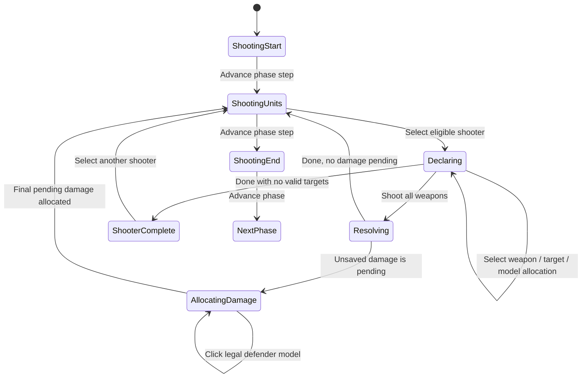

# Interactive Shooting: Current State Machine and Simplification Plan

This document traces the current player-controlled Shooting flow from the
start of the phase through the end of the phase. It describes what the
application does today, identifies duplicate or expensive work, and proposes
a smaller state machine for a later refactor. It does not change game rules.

## Scope

This is the interactive player flow in the web app, not automated simulation
or out-of-phase Snap Shooting/Overwatch.

Primary owners:

- Web orchestration and UI: `apps/web/src/App.tsx`
- Shooting selectors: `apps/web/src/play/usePlayPhaseSelectors.ts`
- Shooting popup: `apps/web/src/play/PlayPanels.tsx`
- Shooting resolution UI action: `apps/web/src/play/playShootingResolution.ts`
- Model/damage click handling: `apps/web/src/play/playModelSelection.ts`
- Core phase rules/actions: `packages/simulator-core/src/engine/phases/shootingPhaseRules.ts` and `shootingPhaseActions.ts`

## Current flow at a glance



`ShootingUnits` is intentionally optional: a player may decline to shoot with
any or all eligible units. The action ledger records opportunities, but none
are required to advance the phase.

## State currently involved

### Authoritative, saved `BattleState`

| State | Purpose in Shooting |
| --- | --- |
| `phase`, `phaseStep`, `activeArmy` | Determines whether the normal Shooting interaction is legal. |
| `units[].activated` | A unit has completed its Shooting action this phase. |
| `units[].firedWeaponIndices` | Tracks profiles already fired for paths that allow partial resolution. |
| `phaseStepActions` | Current step's typed action ledger, including optional `shoot:<side>:<unit>` actions. |
| `activeAttachedShootingUnitId`, `attachedShootingTargetUnitId` | 11e attached-unit restriction: components resolve against the same target. |
| `lastShootingResolution` | Structured dice/result review for the last shooting declaration. |
| `units[].pendingDamageAllocations` | Ordered damage queue awaiting the defender's model choice. |
| `pendingCombatActions` | Event-backed shooting windows; distinct from normal Shooting. |

### Web UI-only state

| State | Purpose |
| --- | --- |
| `playModelSelection` / inspected selection | Identifies the shooter normally, or the defender while allocating damage. |
| `selectedShootingWeaponIndex` | Selected weapon tab; `all` is the default. |
| `selectedShootingTargetId` | Target selected in the popup. |
| `shootingAttackAllocations` | Per weapon/per target model counts. |
| `shootingResolutionOrder` | User-controlled order for weapon-target groups. |
| `shootingResolutionStatus` | `idle` or `rolled`; this is also reused by Fight. |
| `casualtyRemovalShooterId` | Keeps the shooter/result context while defender damage is allocated. |
| `shootingTargetVisibility` and its ref cache | Per target/per weapon exact eligible firing-model indexes. |
| combat-preview ref cache | Cached hit/cover previews by shooter, target, and weapon. |

The authoritative game state and the UI state are both necessary, but the
current UI state is spread across several independent values. That makes
transitions difficult to reason about and causes more derived work after a
small interaction than the interaction itself requires.

## Exact button and click trace

### 1. Advance from Start of Shooting to Shoot

The main phase advance control calls `stepPlayPhase` in `App.tsx`.

1. `advanceStandardPlayPhaseStep` delegates to core `advancePhaseStep`.
2. `advanceShootingPhaseStep` changes `phaseStep` from `shooting-start` to
   `shooting-units`.
3. The entry hook calls `startPlayShootingStep`.
4. `refreshPlayShootingActions(..., false)` creates one optional action per
   potentially eligible friendly unit.
5. Target IDs are deliberately not calculated at this time. The ledger uses
   the opposing live units as a provisional list and marks
   `targetIdsComputed: false`.

This is a good optimization: beginning the Shooting step does not perform
LOS checks for the entire army.

### 2. Click a shooter on the battlefield

`inspectBattleUnit` in `App.tsx` receives the battlefield click.

1. It rejects the click if a damage allocation is pending or another result
   is locked open.
2. It checks that the clicked unit is present in the current Shooting action
   ledger's ready/no-target sets.
3. It updates inspected selection, `playModelSelection`, weapon tab (`all`),
   target ID, and result UI state.
4. `usePlayPhaseSelectors` calls `playShootingWeaponOptions` for that unit.
5. Core does low-cost unit and weapon legality checks and returns provisional
   weapon-to-target options with `deferLineOfSight: true`.
6. A React effect walks the provisional targets one per animation frame and
   calls `playShootingWeaponModelIndexes` for each weapon/target pair. This
   is the exact per-model range, Hidden, and LOS result.
7. Each completed target writes a new `shootingTargetVisibility` map, which
   causes another render.
8. Another effect initializes/repairs default model allocations as targets
   become exactly visible.

The selected-shooter click is intentionally incremental, but it can still
produce many renders: one initial render, then one or more renders per target
whose exact visibility is completed.

### 3. Click a weapon tab

The tab directly calls `setSelectedShootingWeaponIndex`. It does not make a
game-state change, but it currently triggers several derived operations:

1. `selectedPlayShootingTargets` filters target options for the selected
   weapon.
2. `shootingModelStates` loops the selected shooter's models to mark which
   carry the selected weapon and which are eligible against the selected
   target.
3. The selected-target effect may replace `selectedShootingTargetId` if that
   target is not legal for the newly selected weapon.
4. The hit preview runs for the current shooter/target/weapon unless it is
   already cached. It computes model groups, terrain cover per firing model,
   and Plunging Fire where applicable.
5. The parent `App` rerenders and the battlefield canvas redraw effect runs
   with the updated model highlight map.

The first selection of each weapon is therefore materially more than a UI
tab switch. Re-selecting a weapon in the same unchanged `BattleState` should
reuse the combat-preview cache, but it still performs the UI filtering,
model-state derivation, and canvas redraw.

### 4. Choose a target and distribute model counts

The target selector calls `setSelectedShootingTargetId`. Count controls call
`updateShootingAttackAllocation`.

1. The target is checked against the visible target IDs for the active
   weapon/all-weapons view.
2. A count is limited by the weapon's model count, exact visible firing-model
   count, and counts already sent to other targets with the same weapon.
3. `shootingAttackAllocations` is updated.
4. `syncShootingResolutionOrder` keeps the separate ordering list in sync
   with non-zero allocations.
5. The same target/model-highlight and preview derivations described above
   can run again when the selected target changed.

### 5. Reorder weapon-target groups

The arrow controls only update `shootingResolutionOrder`.

This is UI-only and should remain cheap. It currently still rerenders the
parent and popup because the order is owned at the `App` level.

### 6. Press `Shoot all weapons`

`resolveSelectedPlayShooting` performs the declaration and roll.

1. It blocks if damage is pending, or if every ranged weapon has no target.
   In the latter case, `Done` calls `lockPlayUnitShooting` instead.
2. It converts UI allocation state into ordered
   `PlayShootingAttackAllocation[]` entries.
3. It calls core `shootPlayUnitWeapons`.
4. Core clones `BattleState`, rebuilds eligible weapon options, validates that
   every selectable weapon has an allocation, and validates the target.
5. For every weapon-target allocation, core recalculates exact participating
   model indexes and rechecks weapon-target legality.
6. Core resolves the attack rolls, saves structured weapon results, and adds
   deferred damage allocations to the defender(s).
7. Core marks the shooter activated, records fired weapons, updates attached
   shooting locks, and completes/refreshes its action ledger entry.
8. Web state changes to `shootingResolutionStatus: rolled`, creates an undo
   entry, and commits the new battle state.

The resolver avoids repeating per-model LOS *within its own validation and
execution pass*, but it does not consume the UI's exact-visibility cache.
Thus the same model eligibility work normally occurs once for declaration UI
and once more for the authoritative resolve.

### 7. Press `Resolve All` or choose a defender model

If any `pendingDamageAllocations` exist, all other Shooting interaction is
locked.

1. `Resolve All` selects the first pending defender and highlights its models.
2. Clicking a defender model calls `allocatePlayDamageToModel` through
   `createPlayModelSelection`.
3. Core validates the wounded-model rule, applies Feel No Pain if present,
   updates wounds/casualties, and processes destruction consequences.
4. If more damage remains on that defender, it stays selected. Otherwise the
   UI selects the next pending defender, if any.
5. After the final allocation, the web UI clears the result cursor and allows
   another shooter to be selected.

### 8. Press `Done` after a result with no pending damage

`resolveSelectedPlayShooting` clears the UI-only result/selection state. The
shooter was already activated when the declaration resolved.

### 9. Press `Done` for a unit with no targets

`lockPlayUnitShooting` clones the battle state, marks the unit (and attached
components where relevant) activated, completes the optional action ledger
entry, and clears shooting locks. The web layer clears selection state.

### 10. Advance through End Shooting

The phase advance control performs two final transitions:

1. From `shooting-units` to `shooting-end` via `advanceShootingPhaseStep`.
2. From `shooting-end` to the Charge phase through the generic phase-boundary
   path in `stepPlayPhase`.

The generic step dispatcher only blocks required actions. Shooting actions
are optional, so it correctly permits advancing without shooting every unit.

## Current validation tiers

The current shooting code already has a useful legality progression:

1. Unit/phase/side/destroyed/embarked checks.
2. Engagement, weapon-type, attachment, Lone Operative, Blast, and similar
   unit-level restrictions.
3. Base-edge range check.
4. Safe full-Hidden rejection.
5. Exact model-level range and LOS/Hidden checks for surviving pairs.
6. Exact model allocation validation at resolve time.

The expensive work is correct in principle. The problem is when and how often
the later tiers are requested by UI interactions.

## Where the current design spends unnecessary time

| Area | Current behavior | Why it is costly or confusing |
| --- | --- | --- |
| Weapon tab | Changes a UI filter but also updates model highlights, selected targets, hit preview, and canvas state. | A display choice has a large render and calculation footprint. |
| Exact LOS cache | The UI asynchronously computes exact visibility after selection. | It creates one React update per checked target and is not reused by core resolution. |
| Hit preview | First visit to a weapon runs per-model cover/Plunging calculations. | This is useful information, but it should not block a tab interaction. |
| Core resolve | Revalidates model participation and legality after the UI already computed it. | Revalidation is correct, but the data path is duplicated rather than versioned/shared. |
| Parent ownership | Most Shooting UI state lives in `App.tsx`. | A small popup update can redraw the battlefield and re-evaluate unrelated selectors. |
| `shootingResolutionStatus` | A generic `idle`/`rolled` flag is shared between Shooting and Fight. | It obscures which combat workflow is actually active. |
| Selection meaning | `playModelSelection` identifies either shooter or defender, while `casualtyRemovalShooterId` restores shooter context. | The active interaction is implicit across multiple fields. |
| Action ledger | It is both an opportunity list and part of visual readiness state. | UI has to reconcile ledger status against live unit state to avoid stale outlines. |

## Recommended replacement state machine

Keep rules and saved battle facts in core. Replace the spread-out web
shooting state with one explicit UI session object.

```ts
type ShootingSession =
  | { kind: 'idle' }
  | {
      kind: 'declaring';
      stateRevision: number;
      shooterId: string;
      declaration: ShootingDeclarationSnapshot;
      selectedWeaponIndex: 'all' | number;
      selectedTargetId: string | null;
      allocations: ShootingAllocation[];
      resolutionOrder: ShootingResolutionOrderEntry[];
    }
  | {
      kind: 'allocating-damage';
      stateRevision: number;
      shooterId: string;
      resolutionId: string;
      targetId: string;
    };
```

`ShootingDeclarationSnapshot` should contain the eligible weapons, legal
target IDs, and—once requested—the exact participating firing-model indexes.
It is not saved game state. It is a disposable, versioned view of one
unchanged `BattleState`.

### Proposed transitions

| Event | From | To | Work performed |
| --- | --- | --- | --- |
| `START_SHOOTING_STEP` | `idle` | `idle` | Publish lightweight optional shooter IDs only. |
| `SELECT_SHOOTER` | `idle` | `declaring` | Build a declaration snapshot. Run cheap tiers for all enemies; request exact model visibility only for needed targets. |
| `SELECT_WEAPON` | `declaring` | `declaring` | Change only the view filter. Do not recompute legality already in the snapshot. |
| `SELECT_TARGET` | `declaring` | `declaring` | Ensure exact eligibility for that shooter/weapon/target once; use cached result thereafter. |
| `SET_ALLOCATION` / `MOVE_ORDER` | `declaring` | `declaring` | Update UI data only. |
| `RESOLVE_DECLARATION` | `declaring` | `allocating-damage` or `idle` | Validate the snapshot revision, resolve exactly once, save result, then enter damage state only if damage is pending. |
| `ALLOCATE_DAMAGE` | `allocating-damage` | same or `idle` | Apply one queued packet; choose next pending target or finish. |
| `SKIP_SHOOTING` | `declaring` | `idle` | Mark the selected unit complete without attacks. |
| `END_SHOOTING_STEP` | `idle` | next phase step | No active session may remain. |

## Simplification rules for the refactor

1. A weapon tab is presentation state. It must not start a rules query.
2. A target click may request exact model eligibility once. Store the result in
   the declaration snapshot keyed by weapon and target.
3. The hit preview is optional presentation. Defer it until the target is
   selected and show a lightweight placeholder while it computes.
4. The resolver should either consume the same immutable snapshot after a
   state-revision check, or recompute once only when the revision changed.
   Never trust UI data without that check.
5. The battlefield should receive a small, stable highlight model instead of
   every popup state value. Memoize the canvas component so a tab/order click
   does not redraw it unless highlights actually changed.
6. Give Shooting and Fight separate UI session types. Do not reuse
   `shootingResolutionStatus` as a generic combat workflow flag.
7. Keep the phase action ledger as a lightweight saved opportunity inventory;
   do not make it own popup or target-display state.

## Suggested implementation order

1. Add a temporary performance trace around declaration snapshot creation,
   exact model visibility, hit preview, and battlefield redraw. Establish a
   baseline in a production build.
2. Introduce `ShootingSession` alongside the existing state, without changing
   core rules. Route weapon and target selection through it.
3. Make weapon-tab switching snapshot-only. Verify repeat tab switches are
   immediate.
4. Move exact model eligibility into the snapshot and pass its validated
   result into core resolution when its `stateRevision` is still current.
5. Split/memoize the battlefield render boundary so popup-only changes do not
   redraw the board.
6. Replace the old independent UI fields and remove the compatibility glue.

## Implementation status

The first migration step is now in place:

- `apps/web/src/play/shootingSession.ts` defines the pure `ShootingSession`
  reducer and its typed events.
- `apps/web/src/play/useShootingSession.ts` is the React adapter.
- `usePlayUiState` now sources Shooting target, weapon, allocation, ordering,
  result-status, and shooter-cursor values from that one session.
- Selecting a shooter begins an explicit declaration session; resolving with
  pending damage enters explicit damage-allocation state; clearing a result,
  final damage allocation, undo, redo, and phase exit clear the session.

Fight now has its own `FightSession` reducer as well. It owns Fight's weapon,
target, movement/consolidation choices, allocations, and resolution status;
Fight no longer uses Shooting's result cursor.

The declaration snapshot path is now also in place:

- Selecting a shooter freezes a copy of its weapon options and candidate
  target IDs in `ShootingSession`.
- Weapon tabs read that immutable declaration copy. They no longer restart
  the target/LOS work because the selected-weapon target list changed.
- Exact LOS continues to run against the snapshot's complete candidate set
  and is cached per unchanged battle state.
- Per-weapon hit previews are deferred until after a specific weapon tab has
  painted; the `All` tab does not calculate every weapon preview.

Exact target eligibility is now part of the same session as the declaration.
It is requested only for a target the player has selected or allocated models
to; the prior background pass over every opposing unit was removed. The combat
panel shows **Check** beside unchecked targets, and enables allocation only
after the cached exact LOS result confirms participating firing models.

Declaration construction now has an explicit broad-phase API separate from
the core's exact `playShootingWeaponOptions` API. The broad phase applies
range and non-geometric targeting restrictions but never casts terrain rays;
the exact check is batched for all selected weapon profiles against one target
so their shared terrain visibility scan is reused.

The Battlefield is memoized against a semantic board view. Popup-only edits
such as weapon tabs, allocation counters, and resolution order do not redraw
the board unless they actually change a board highlight, selection, or battle
state. Stable event delegates keep board clicks bound to the latest UI state.

Core resolution remains the authority and revalidates the declaration before
rolling. The snapshot only prevents presentation interactions from issuing
duplicate discovery work.

## Decision to make before implementation

The main policy decision is whether a selected shooter should calculate exact
model visibility for every candidate target in the background, or only when a
player selects/opens a target. For responsiveness, the recommended default is
on-demand exact visibility, with optional idle-time prefetch after the popup
has become interactive. The selected target should always be first.
