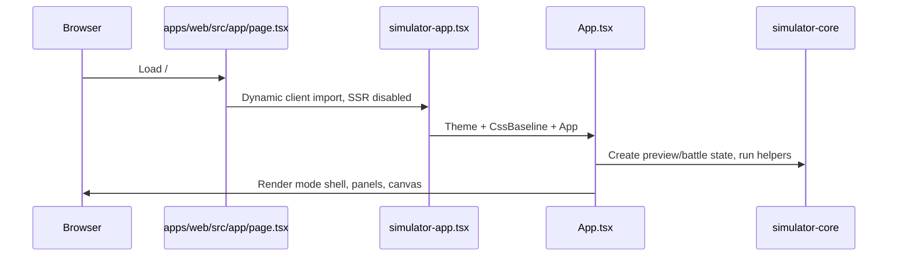
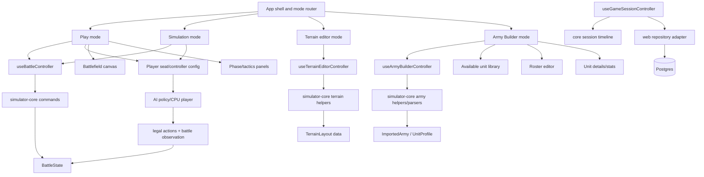
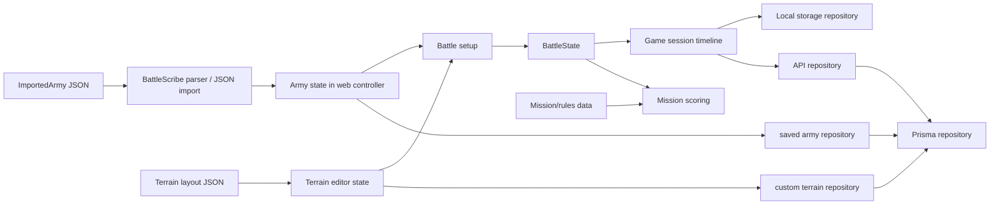
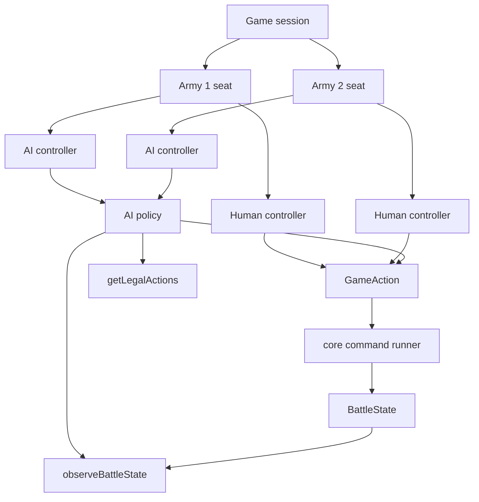
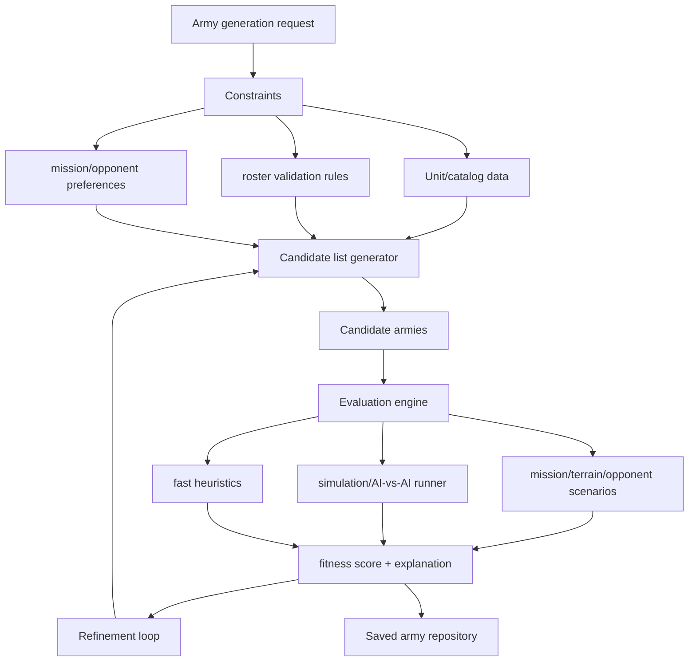
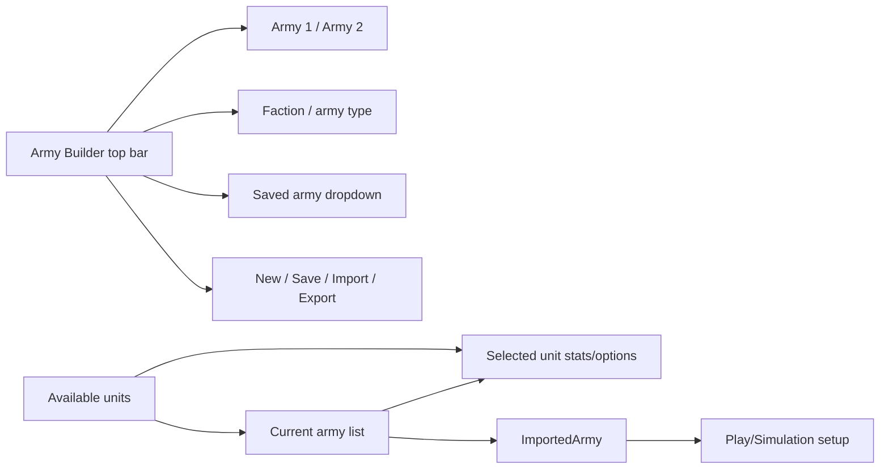

# Warhammer Simulator Architecture

Last updated: 2026-07-02

This document is the architecture handoff for continuing work from any machine. It describes the current repo shape, the target boundaries, and the refactor order to use before adding more 11th Edition rules or the Army Builder mode.

## Goals

- Keep game rules, data, parsers, and simulation behavior in `packages/simulator-core`.
- Keep React focused on presentation, user input, and calling core helpers.
- Make play, simulation, terrain editing, game session save/load, and army building separate workflows instead of one large app component.
- Keep changes easy to test with core unit tests and root `npm run build`.
- Avoid adding new feature logic into already oversized modules without first extracting a focused boundary.

## Current Repo Shape

```mermaid
flowchart TD
  User[Browser User] --> NextPage[apps/web Next App Router]
  NextPage --> SimulatorApp[simulator-app.tsx]
  SimulatorApp --> App[App.tsx]

  App --> UI[React components]
  UI --> Battlefield[Battlefield canvas]
  UI --> ArmyPanel[ArmyPanel]
  UI --> TerrainEditor[TerrainLayoutEditor]
  UI --> SaveLoadPanels[Game save/load panels]

  App --> Core[@warhammer-simulator/core]
  Battlefield --> Core
  ArmyPanel --> Core

  Core --> Types[types]
  Core --> Engine[engine]
  Core --> Data[data/json]
  Core --> Parsers[parsers]
  Core --> Sessions[session timeline/scenarios]

  App --> SaveLoadClient[save/load repository adapter]
  SaveLoadClient --> ApiRoutes[Next API routes]
  SaveLoadClient --> LocalStorage[local fallback]
  ApiRoutes --> PrismaRepo[Prisma repository]
  PrismaRepo --> Postgres[(Postgres)]
```

### Workspaces

- Root package: npm workspace coordinator, build/test/lint scripts.
- `apps/web`: Next/React UI, API routes, Prisma persistence adapter, CSS.
- `packages/simulator-core`: rules types, engine, data, parsers, and game session timeline/scenario logic.
- `rules`: source/audit/reference documents for rules implementation.

### Current Entry Flow



## Current Module Responsibilities

### `apps/web/src/App.tsx`

Current responsibilities:

- App mode state: play, simulation, editor.
- Army state, local save/load, import/export calls.
- Battle setup state: edition, missions, deployment, board format, terrain.
- Game session timeline and save/load orchestration.
- Terrain editor state and layout import/export.
- Manual play state: selected unit/model, shooting/charge/fight selections, stratagems, abilities, undo.
- Many UI panels for play-phase controls.
- Calls into simulator-core for almost every rules action.

Risk:

- This is the main coordination point, but it is also carrying workflow logic and UI rendering. New Army Builder work would make this worse if added directly.

### `apps/web/src/components/ArmyPanel.tsx`

Current responsibilities:

- Import BattleScribe JSON through the core parser.
- Normalize army editing data.
- Show army summary and deployment strategy controls.
- Edit units before battle: model count, leader attachments, transport/deployment mode, split units, model weapon loadouts.
- Show play deployment lists and in-game unit lists.

Risk:

- Pre-game army editing, in-game deployment selection, and static roster display are mixed. Army Builder should reuse the editing logic, not clone this component.

### `apps/web/src/components/Battlefield.tsx`

Current responsibilities:

- Canvas rendering for board, terrain, objectives, units, LOS, movement HUD, and selection overlays.
- Pointer interactions for play model editing, terrain editing, panning, zooming, and selection.

Risk:

- Canvas rendering and interaction state are coupled. It is workable for now, but future rendering changes should avoid adding unrelated game rules here.

### `packages/simulator-core/src/engine/simulator.ts`

Current responsibilities:

- Battle creation and deployment.
- Phase advancement.
- Movement, shooting, charge, fight, damage, transports, reserves, actions, coherency, aircraft, terrain interactions.
- Manual play helpers for UI actions.
- Mission event tracking hooks.

Risk:

- This file is the core pressure point. It contains many good pure helpers, but the boundary between phase engine, attack engine, movement legality, transports, manual play commands, and mission events is too broad.

### `packages/simulator-core/src/engine/*`

Current supporting modules:

- `rulesEngine.ts`: edition/rules metadata and ruleset behavior.
- `missionScoring.ts`: primary/secondary scoring evaluation.
- `stratagems.ts`, `unitAbilities.ts`: available rules/actions for selected timing.
- `terrain.ts`, `terrainGeometry.ts`, `objectiveGeometry.ts`: layout conversion and geometry checks.
- `deployment.ts`, `deploymentBrain.ts`: deployment logic and simple learning strategy.
- `coherency.ts`, `movement.ts`, `battleRound.ts`, `commandPoints.ts`, `battleshock.ts`: focused rule helpers.
- `legalActions.ts`, `battleObservation.ts`: AI and session-analysis helper surface.

### `packages/simulator-core/src/practice/*`

Current responsibilities:

- Action records.
- Timeline state and replay.
- Scenario metadata/storage contracts.
- Local browser repository fallback.

This layer is already closer to the desired shape: core defines contracts and pure timeline behavior, web supplies API/database adapters.

Naming note:

- The current code still uses `practice` names for this subsystem.
- Product language should move to game/session terms: a person can play both armies, play against AI, simulate a game, or save/load a game state.
- Do not add new user-facing “practice game” language. Rename code paths gradually as part of a focused migration.

## Target Architecture



### Desired Boundaries

- `App.tsx` should become a thin shell:
  - Own current mode.
  - Choose mode-specific top-level view.
  - Provide shared theme/modal wiring.
  - Avoid owning every workflow state directly.

- Mode views should own their workflow:
  - `PlayView`: battlefield canvas, phase controls, play panels.
  - `SimulationView`: auto-run controls and log-oriented simulation view.
  - `TerrainEditorView`: terrain layout editor and import/export.
  - `ArmyBuilderView`: unit catalog, roster editor, unit details.

- Controllers/hooks should group state transitions:
  - `useBattleController`
  - `useGameSessionController`
  - `useTerrainEditorController`
  - `useArmyBuilderController`

- Simulator core should expose focused command modules:
  - `engine/battleSetup.ts`
  - `engine/phaseEngine.ts`
  - `engine/attackSequence.ts`
  - `engine/movementLegality.ts`
- `engine/playCommands.ts`
- `engine/missionEvents.ts`
- `engine/transports.ts`
- `engine/reserves.ts`
- `engine/playerControllers.ts`
- `engine/aiPolicies.ts`

These names are proposed boundaries, not a requirement to create all files immediately.

## Data and State Ownership



Ownership rules:

- `ImportedArmy`, `UnitProfile`, `BattleState`, mission definitions, terrain layouts, and parsers belong to simulator-core.
- Local UI selections, open modals, selected rows, and in-progress form controls belong to web components/hooks.
- Game session timeline replay logic belongs to simulator-core; database and HTTP transport belong to web.
- Army Builder should persist the same `ImportedArmy` shape already used by Play and Simulation.

## Persistence Strategy

The long-term app should treat persistence as repository adapters around portable core data shapes. The database should not become the source of rules behavior; it should store user/game state.

Database-backed over time:

- Game sessions: saved games, checkpoints, timelines, branches, player/AI seat settings, tags, notes.
- Armies/rosters: saved `ImportedArmy` records, imported BattleScribe JSON, Army Builder edits, metadata such as faction and points limit.
- User-created terrain layouts: custom `TerrainLayout` records, terrain mat templates, ownership/sharing metadata.
- Users and sharing: accounts, ownership, collaboration, public/private flags.
- AI memory/training records: game outcomes, observations/actions, policy metadata, evaluation runs.

File/package-backed:

- Official/sample terrain layouts.
- Mission definitions.
- Rules definitions.
- Base-size data.
- Sample armies and seed catalogs.
- Rules reference/audit documents under `rules/`.

Hybrid:

- Terrain layouts: built-in layouts ship as files; user-created/custom layouts should eventually persist through a repository and database.
- Armies: imported JSON should remain portable, but saved rosters should use a repository that can be backed by local storage now and Postgres later.
- Game sessions: Postgres should be primary when available, with local fallback for development/offline use.

Target repository boundaries:

- Core defines shapes and pure behavior: `ImportedArmy`, `TerrainLayout`, `BattleState`, game/session timeline records, scenario metadata.
- Web owns persistence adapters: local storage, HTTP API, Prisma/Postgres.
- UI controllers call repositories, not Prisma or `localStorage` directly.

## Dependency Rules

Allowed:

- `apps/web` imports `@warhammer-simulator/core`.
- `apps/web/src/server/*` imports Prisma and core session/save contracts.
- `packages/simulator-core` imports only its own modules and data.
- Core test code imports core modules directly.

Avoid:

- Core importing from `apps/web`.
- React components implementing new rules behavior that belongs in core.
- API/database adapters leaking Prisma shapes into core.
- New features adding more unrelated state to `App.tsx`.
- Army Builder cloning existing ArmyPanel editing helpers instead of extracting them.

## Player and AI Architecture

The app should support three play styles without changing the core game model:

- Human controls both armies.
- Human controls one army and AI controls the other.
- AI controls both armies for simulation.

The architecture should model this as player seats/controllers, not as separate game types.



Current useful pieces:

- `engine/legalActions.ts` already enumerates available `GameAction` choices.
- `engine/battleObservation.ts` already creates compact state observations.
- `engine/deploymentBrain.ts` already experiments with strategy/memory and notes that a neural policy could replace parts later.
- Practice/session timelines already record actions and before/after state, which can become training/evaluation data.

Target concepts:

- `PlayerSeat`: side, controller type, display name, and optional AI policy id/config.
- `PlayerController`: interface that can request/choose the next `GameAction` for a side.
- `HumanController`: waits for UI input and dispatches explicit actions.
- `AiController`: observes the battle, gets legal actions, asks a policy to choose one, then dispatches it.
- `AiPolicy`: pure decision layer that can start simple and later become heuristic, learned, remote, or model-backed.
- `CommandRunner`: applies a `GameAction` to a `BattleState` through core commands and returns the next state plus logs/errors.

Design rules:

- AI must choose from legal core actions; it should not mutate `BattleState` directly.
- The same `GameAction` path should drive human play, AI-vs-human, AI-vs-AI simulation, replay, and saved timelines.
- AI policy code belongs in simulator-core or a future AI package when it is pure. UI adapters and hosted model calls belong in web/server code.
- Persist AI seat configuration and action history with game sessions so simulations can be replayed and compared.
- Keep observations intentionally compact and serializable so they can feed heuristics now and training/evaluation later.

Suggested future files:

- `packages/simulator-core/src/engine/playerControllers.ts`
- `packages/simulator-core/src/engine/aiPolicies.ts`
- `packages/simulator-core/src/engine/gameActionRunner.ts`
- `packages/simulator-core/src/ai/heuristicPolicy.ts` if AI grows beyond engine helpers.
- `apps/web/src/hooks/usePlayerControllers.ts`

Next after this task: make `GameAction` execution a clean core boundary before adding complex AI behavior.

## AI Army Generation Architecture

The app should also support AI-assisted army creation. This is separate from the in-game CPU player, but it should use compatible data and evaluation loops.

Existing notes in the repo:

- `simulations/orks_vs_necrons_matchup_matrix.md`: compares Ork roster shells into a known Necron list across mission/deployment/terrain setups.
- `simulations/best_warhorde_vs_necrons_final.md`: records a tuned Ork War Horde list and explains why it performs into a target Necron roster.
- `simulations/triple_lokhust_necron_roster_suggestion.md`: proposes a revised Necron list skeleton and explains list-building tradeoffs.
- `simulations/*`: several matchup reports already use the shape of an army-generation loop: propose roster variants, evaluate into scenarios, explain strengths/weaknesses, then refine.

Target capability:

- Generate a legal or near-legal army list for a chosen faction, detachment, point limit, mission pack, and expected opponent.
- Explain why units were selected: threats answered, scoring plan, screening, mobility, durability, anti-tank/anti-elite output, objective play.
- Simulate or estimate performance across a scenario matrix.
- Refine lists over repeated runs using saved outcomes and action histories.
- Save generated armies through the same army repository used by Army Builder.



Important boundaries:

- Army generation should create `ImportedArmy`/roster-shaped data that Army Builder can inspect and edit.
- Roster validation should live in core or a future catalog package, not in React.
- The generator should use a unit catalog abstraction. Today we have sample armies and BattleScribe/New Recruit JSON imports; full faction catalogs are a separate data-source problem.
- Evaluation should use the same simulation engine and player/AI controller architecture as normal AI-vs-AI games.
- Explanations should be stored with generated armies so users can see the plan later.

Suggested future data concepts:

- `ArmyCatalog`: available units, wargear options, roles, points, faction/detachment metadata.
- `RosterConstraints`: faction, detachment, point limit, allowed allies, required/limited categories.
- `ArmyGenerationRequest`: constraints plus opponent, mission pack, preferred playstyle, and risk tolerance.
- `GeneratedArmyCandidate`: army data plus score, explanation, validation warnings, and source policy.
- `ArmyEvaluationResult`: scenario results, matchup notes, expected scoring plan, weaknesses.

Suggested future files:

- `packages/simulator-core/src/army/catalog.ts`
- `packages/simulator-core/src/army/rosterValidation.ts`
- `packages/simulator-core/src/army/armyGeneration.ts`
- `packages/simulator-core/src/army/armyEvaluation.ts`
- `apps/web/src/components/army/GeneratedArmyReview.tsx`

First version:

- Start from imported/sample armies and simple transformations: add/remove duplicate units, swap known role packages, adjust model counts/loadouts.
- Use heuristics before expensive simulation: role balance, points fit, mobility, durability, threat coverage, scoring units.
- Run a small scenario matrix only after candidates pass basic validation.
- Save generated candidates as normal saved armies.

Next after this task: define the army catalog/validation data source before promising fully legal automated list building.

## Refactor Roadmap

### 1. Architecture Inventory

Status: this document is the first inventory.

Next after this task: extract the smallest mode-shell boundary from `App.tsx`.

### 2. Extract Mode Shell

Goal:

- Keep `App.tsx` as a mode router and shared state coordinator.
- Move mode-specific layout rendering into separate components.

Suggested files:

- `apps/web/src/modes/AppShell.tsx`
- `apps/web/src/modes/PlayModeView.tsx`
- `apps/web/src/modes/SimulationModeView.tsx`
- `apps/web/src/modes/TerrainEditorModeView.tsx`

Verification:

- Root `npm run build`.
- No behavior change expected.

Next after this task: extract army editing helpers before building Army Builder.

### 3. Extract Army Editing Domain

Goal:

- Reuse current unit editing behavior in both the existing side panel and future Army Builder.

Candidate core/helper functions:

- Normalize imported armies for editing.
- Change model count and resize loadouts.
- Update model weapon loadout.
- Attach/detach leaders.
- Change transport/deployment assignment.
- Split eligible units.
- Build transport and leader manifests.

Suggested files:

- `packages/simulator-core/src/engine/armyEditing.ts`
- `apps/web/src/components/army/ArmyRosterEditor.tsx`
- `apps/web/src/components/army/ArmyImportExportControls.tsx`

Verification:

- Core tests for army editing helpers.
- Root `npm run build`.

Next after this task: resume 11th mission/event tracking or start Army Builder layout with the extracted editor.

### 4. Extract Game Session Controller

Goal:

- Move game session timeline/save/load orchestration out of `App.tsx`.
- Keep repository fallback behavior unchanged.
- Use game/session naming for the new controller even while it wraps the current `practice` repository/files.

Suggested files:

- `apps/web/src/hooks/useGameSessionController.ts`
- Keep `apps/web/src/practice/apiPracticeScenarioRepository.ts` as the initial adapter until a separate rename migration is done.

Verification:

- Root `npm run build`.
- Existing session/practice scenario tests in simulator-core.

Next after this task: extract play-phase controller state.

### 5. Extract Play Controller

Goal:

- Group manual play state and action handlers away from rendering.
- Keep UI panels declarative.

Suggested files:

- `apps/web/src/hooks/usePlayController.ts`
- `apps/web/src/components/play/PlayShootingPanel.tsx`
- `apps/web/src/components/play/PlayChargePanel.tsx`
- `apps/web/src/components/play/PlayFightPanel.tsx`
- `apps/web/src/components/play/PlayTacticsPanel.tsx`

Verification:

- Root `npm run build`.
- Relevant simulator-core tests.

Next after this task: move focused groups out of `engine/simulator.ts`.

### 6. Split Simulator Core by Rule Area

Goal:

- Reduce `engine/simulator.ts` into focused modules without changing public behavior.

Priority extraction order:

1. Mission events (`missionEvents.ts`)
2. Attack sequence and damage allocation (`attackSequence.ts`, `damageAllocation.ts`)
3. Movement legality and model movement commands (`movementLegality.ts`, `playMovement.ts`)
4. Transports and reserves (`transports.ts`, `reserves.ts`)
5. Phase transitions (`phaseEngine.ts`)

Verification:

- `npm --workspace @warhammer-simulator/core run test`
- Root `npm run build`

Next after this task: continue 11th Edition rules work with tests in the extracted modules.

## Army Builder Target

Army Builder should be a dedicated mode, not a panel inside Play.



First version:

- Use sample armies and imported armies as the available unit source.
- Preserve JSON import/export and local save.
- Reuse extracted army editing helpers.
- Do not build full roster validation until the unit catalog/source-of-truth question is settled.

Next after this task: decide whether full faction catalogs live in core data, imported BattleScribe data, or a new catalog package.

## 11th Edition Rules Target

The remaining 11th rules work should favor core modules and tests:

- Mission event tracking belongs in simulator-core.
- Automatic primary/secondary scoring belongs in mission scoring modules.
- UI should display scoring explanations from core results rather than reconstructing rule reasons.
- Edition differences should be represented by `RulesEdition`, mission definitions, or focused helper modules.

Next after this task: implement missing mission/event state in a focused core module, then add tests before wiring UI explanations.

## Verification Policy

- Docs-only changes: no build required.
- Frontend/component refactors: root `npm run build`.
- Core rules/data changes: `npm --workspace @warhammer-simulator/core run test`, plus root `npm run build` when web imports are affected.
- Dev server: only start when explicitly requested, and stop it before ending the task.
